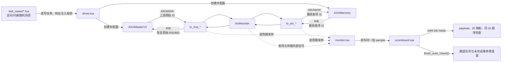

# AxiReorder 模块验证报告（简版）

> 验证对象：`AxiReorder`
> 验证层级：模块级 UT
> 报告依据：当前 RTL、Lua 验证环境、测试点及测试用例的静态检查，并保留原报告中的覆盖率记录
> 报告状态：待确认；本文未重新执行回归，不能替代最终签核记录

## 1. 验证概述

`AxiReorder` 位于 AXIXbar 上游，用于处理可能发生同ID请求去往不同 Slave 造成的乱序返回。模块为读写请求分配内部重排表项 ID，响应返回后再恢复原始 `RID/BID`。验证重点是同 ID 保序、不同 ID 乱序完成、ID 恢复、读写并发、背压、表项管理和复位行为。

当前验证资产包含 14 个用例文件、 13 个 P0 测试点和 21 个 P1 测试点。

代码覆盖率为 Line 100%、Condition 99.86%、Branch 100%、端口 Toggle 98.67%。经检查剩下的是需要exclaude的信号，exclaude无用信号和不可达条件，覆盖率能达到100%。因此本报告的结论为：**验证环境和主要场景已建立，但回归通过状态及覆盖率证据仍需补齐后才能签核。**

## 2. DUT 基本参数

| 参数 | 值 | 说明 |
| --- | ---: | --- |
| `addrBits` | 48 | AXI 地址宽度 |
| `idBits` | 12 | 上游原始 AXI ID 宽度 |
| `dataBits` | 256 | 每拍 32 Byte，`WSTRB` 为 32 bit |
| `lenBits` | 8 | `AxLEN` 宽度 |
| `sizeBits` | 3 | `AxSIZE` 宽度 |
| `lastBits` | 1 | 支持 `RLAST/WLAST` |
| `buffer` | 64 | 读、写重排表各 64 项 |
| 下游重映射 ID | 6 bit | 由 64 个表项编号决定 |
| `AW` 队列 | 1 项 | `Queue(..., entries=1, pipe=true)` |
| `W` entry 队列 | 2 项 | 保存写数据对应的表项号 |
| `W` 数据队列 | 2 项 | 保存写数据及其表项号 |
| 复位 | 异步、高有效 | 复位时清空重排表有效位 |

主要接口为上游 `io_mst_*` 和下游 `io_slv_*`，均包含 AXI `AW/W/B/AR/R` 五个通道。下游请求 ID 是表项号，上游响应 ID 应恢复为原始请求 ID。

## 3. 验证框架

验证数据流如下：



| 文件或目录 | 作用 |
| --- | --- |
| `tc_main.lua` | 读取 `TC_NAME/SEED`，加载用例，执行复位、monitor 启动、用例任务和 scoreboard 收尾检查 |
| `src/cfg.lua` | 控制 monitor、详细日志和 heartbeat 开关 |
| `src/env.lua` | 驱动默认空闲值、执行 10 周期复位、启动周期采样任务 |
| `src/common/clock_reset.lua` | 提供时钟等待和复位操作 |
| `src/common/axi_stimulus.lua` | 生成合法 burst、地址、数据和 strobe |
| `src/dut/driver.lua` | 连接上游 AXI Master 和下游 AXI Memory，提供阻塞/非阻塞读写及响应注入接口 |
| `src/dut/signals.lua` | 汇总 DUT 端口及定向覆盖用例使用的只读内部信号句柄 |
| `src/dut/monitor.lua` | 逐周期采样端口，只在 `valid && ready` 时形成有效握手记录并通知订阅者 |
| `src/dut/scoreboard.lua` | 比对 payload、ID 映射和同 ID 顺序；结束时检查所有期望队列为空 |
| `src/components/AXI/test_zhujiang_utils/` | 提供 `AXI4MasterV2`、`AXI4Memory` 及 AXI 通道模型 |
| `test_cases/*.lua` | 定向和约束随机测试用例 |
| `test_points/*.lua` | 功能/微架构测试点及用例反标关系 |

公共随机种子由 `SEED` 指定，未设置时为 `1`。Driver 最多管理 64 个并发事务，单事务超时为 2,000,000 周期；AXI Master 和 Memory 均可插入随机延迟，Memory 可乱序返回 `R/B` 并注入四类 AXI 响应码。

### 3.1 AXI Master 参数配置

| 参数 | 当前值 | 作用 |
| --- | ---: | --- |
| `clock_chdl` | `dut.clock` | Master 事务状态机及五个 AXI 通道均按 DUT 时钟上升沿推进 |
| `cycles_chdl` | `dut.cycles` | 提供日志时间戳和调试周期计数 |
| `nr_task` | 64 | 最多同时管理 64 个未完成读写事务 |
| `timeout_max` | 2,000,000 周期 | 单个事务等待 AR/AW/W 握手或 R/B 返回的最大周期数，超时触发断言 |
| `nr_ar_taskbuf` | 64 | AR 通道待发送任务缓冲深度 |
| `nr_aw_taskbuf` | 64 | AW 通道待发送任务缓冲深度 |
| `nr_w_taskbuf` | 64 | W 通道待发送任务缓冲深度 |
| `enable_ar/aw/w_delay` | `false`（默认值） | Master 不延迟 AR/AW/W valid 的发起 |
| `enable_r_delay` | `true` | 在 Master 的 `RREADY` 上插入反压 |
| `r_delay_min/range` | 20 / 20 | `RREADY` 随机等待 20 至 40 周期后拉高 |
| `enable_b_delay` | `true` | 在 Master 的 `BREADY` 上插入反压 |
| `b_delay_min/range` | 20 / 20 | `BREADY` 随机等待 20 至 40 周期后拉高 |
| `random_delay` | `true` | 已启用通道使用 `min + [0, range]` 的随机时延 |
| `enable_randomize_fields` | `true` | 通道事务结束后随机化非握手 payload，检查 DUT 是否错误依赖无效周期字段 |
| `verbose` | `true` | 打印 Master Agent 事务及通道日志 |

### 3.2 AXI Memory 参数配置

| 参数 | 当前值 | 作用 |
| --- | ---: | --- |
| `clock_chdl` | `dut.clock` | 请求接收、存储访问及响应发送均按 DUT 时钟上升沿推进 |
| `cycles_chdl` | `dut.cycles` | 计算响应就绪周期并提供日志时间戳 |
| `data_width` | 256 bit | 每拍数据宽度为 32 Byte，对应常用 `AxSIZE=5` |
| `enable_ar_delay` | `true` | 随机推迟 `ARREADY`，模拟读地址接收反压 |
| `ar_delay_min/range` | 20 / 20 | AR 接收延迟为 20 至 40 周期 |
| `enable_aw_delay` | `true` | 随机推迟 `AWREADY`，模拟写地址接收反压 |
| `aw_delay_min/range` | 20 / 20 | AW 接收延迟为 20 至 40 周期 |
| `enable_w_delay` | `true` | 随机推迟 `WREADY`，模拟写数据接收反压 |
| `w_delay_min/range` | 20 / 20 | W 接收延迟为 20 至 40 周期 |
| `enable_r_delay` | `true` | 推迟 `RVALID` 及读数据返回 |
| `r_delay_min/range` | 100 / 100 | R 响应延迟为 100 至 200 周期 |
| `enable_b_delay` | `true` | 推迟 `BVALID` 写响应返回 |
| `b_delay_min/range` | 100 / 100 | B 响应延迟为 100 至 200 周期 |
| `random_delay` | `true` | 所有已启用通道使用 `min + [0, range]` 的随机时延 |
| `shuffle_r` | `true` | 多笔读事务待返回时随机选择可返回事务，允许不同 ID 的 R 乱序完成 |
| `shuffle_b` | `true` | 多笔写事务待返回时随机选择可返回事务，允许不同 ID 的 B 乱序完成 |
| `nr_r/w/b_taskbuf` | 64 / 64 / 64（默认值） | R、W、B 内部任务缓冲深度；driver 未覆盖组件默认值 |
| `resp_hook` | 已启用 | 按通道、地址、ID、len、size、burst 匹配响应注入规则；未命中时返回 OKAY |
| `enable_randomize_fields` | `true` | 响应完成或通道空闲时随机化非握手 payload |
| `verbose` | `false` | 日常回归不打印 Memory 详细日志 |

### 3.3 Scoreboard 对比逻辑

Monitor 每周期统一采样 DUT 上下游接口，只有 `valid && ready` 时才将握手记录发布给 scoreboard。Scoreboard 根据 AXI 通道的顺序约束选择 FIFO 或非顺序匹配：

| 对比项 | 期望记录来源 | 实际结果来源 | 对比字段/规则 | 匹配方式 |
| --- | --- | --- | --- | --- |
| AW 请求 | 上游 `mst_aw` 握手 | 下游 `slv_aw` 握手 | `addr/len/size/burst/lock/cache/prot/qos/region` 必须一致 | FIFO；下游 AW 顺序与上游接收顺序一致 |
| W 数据 | 上游 `mst_w` 握手 | 下游 `slv_w` 握手 | `data/strb/last` 必须一致 | FIFO；逐 beat 顺序对比 |
| AR 请求 | 上游 `mst_ar` 握手 | 下游 `slv_ar` 握手 | `addr/len/size/burst/lock/cache/prot/qos/region` 必须找到完整匹配项 | 非顺序；允许不同上游 ID 的读请求重排发送 |
| R 响应 | 下游 `slv_r` 握手 | 上游 `mst_r` 握手 | `data/resp/last` 必须找到完整匹配项 | 非顺序；允许不同 ID 的读响应乱序完成 |
| B 响应 | 下游 `slv_b` 握手 | 上游 `mst_b` 握手 | `resp` 必须找到匹配项 | 非顺序；允许不同 ID 的写响应乱序完成 |
| 读 ID 与同 ID 顺序 | 上游 ARID、AR 字段和下游读表项 ID | 下游 R 表项 ID及上游 RID | 下游表项 ID 必须属于当前上游 ARID 的队首未完成事务；RLAST 后出队 | 每个上游 ARID 独立 FIFO |
| 写 ID 与同 ID 顺序 | 上游 AWID、AW 字段和下游写表项 ID | 下游 B 表项 ID及上游 BID | 下游表项 ID 必须属于当前上游 AWID 的队首未完成事务；B 完成后出队 | 每个上游 AWID 独立 FIFO |
| reset 状态 | reset 连续有效至少两个采样周期 | DUT 上下游握手状态 | `ARREADY/AWREADY=1`、`WREADY=0`，且下游请求与上游响应 valid 均为 0 | 周期断言，同时清空全部期望队列和读写事务表 |
| 用例收尾 | 仿真期间累计的全部期望项 | `finish_auto_check()` | AW/W/AR/R/B 期望项以及每个 ID 的读写事务队列均必须为空 | 零遗留检查，发现未完成或未匹配事务即失败 |

下游 `ARID/AWID` 是 AxiReorder 分配的重排表项 ID，并非上游原始 AXI ID，因此地址通道 payload 对比不直接比较 ID。Scoreboard 通过读写事务表建立“上游原始 ID－下游表项 ID”的关联，再分别检查 RID/BID 恢复和同 ID FIFO 顺序；不同 ID 之间允许乱序。任一字段不匹配、响应无对应请求、同 ID 顺序错误或用例结束仍有遗留事务都会立即触发断言。

## 4. 验证流程

1. 初始化 Verilua 环境并生成 `AxiReorder` RTL。
2. 选择 `TC`、`SEED` 和 `LOOP`，编译并运行普通仿真。
3. `tc_main.lua` 设置随机种子、复位 DUT、启动 monitor，再依次执行用例任务。
4. monitor 将接口握手送入 scoreboard；用例结束后 `finish_auto_check()` 检查未匹配事务。
5. 使用 coverage 目标运行选定用例并合并 VDB，检查 Line、Condition、Branch 和端口 Toggle。
6. 对覆盖缺口运行定向用例，或完成不可达分析和 waiver 评审；最后保存日志、波形和覆盖率报告。

参考命令：

```bash
source /nfs/home/yanglucheng/tools/verilua/v3.4.0/verilua.sh
xmake r -P . rtl

# 普通仿真和波形
TC=004 SEED=1 LOOP=5000 MODE=1 xmake run -P . TestAxiReorder
TC=004 SEED=1 LOOP=5000 DUMP=1 MODE=1 xmake run -P . TestAxiReorder

# 覆盖率仿真
TC=004 SEED=1 LOOP=5000 MODE=1 xmake run -P . TestAxiReorderVcsCov

# 调试
verdi -ssf build/vcs/TestAxiReorder/004.vcd.fsdb
verdi -cov -covdir build/vcs/TestAxiReorderVcsCov/sim_build/simv.vdb
```

## 5. 测试用例说明

除特别说明外，随机用例默认 `SEED=1`。

| TC | 用例 | 类型/默认 LOOP | 验证目标 |
| --- | --- | --- | --- |
| 000 | `000_smoke.lua` | DT / 1 次 | 单笔写入后同地址读回，检查基本读写数据通路 |
| 001 | `001_reset.lua` | DT / 1 次 | 检查复位期间输出静默及复位释放后的读写恢复 |
| 002 | `002_same_id_write.lua` | CRV / 5000 | 多笔相同 AWID 写事务保序、BID 恢复及随机 burst/响应 |
| 003 | `003_different_id_write.lua` | CRV / 5000 | 不同 AWID 写事务乱序完成、通道关联及 BID 恢复 |
| 004 | `004_same_id_read.lua` | CRV / 5000 | 多笔相同 ARID 读事务保序及 RID 恢复 |
| 005 | `005_different_id_read.lua` | CRV / 5000 | 不同 ARID 读事务乱序完成及 RID 恢复 |
| 006 | `006_random_id_read.lua` | CRV / 5000 | 随机 ID、地址、burst、size 和响应的读压力测试 |
| 007 | `007_random_id_write.lua` | CRV / 5000 | 随机 ID、地址、burst、size、strobe 和响应的写压力测试 |
| 008 | `008_parellel_RandW.lua` | CRV / 5000 | 随机读写并发，检查时间重叠和读写通道隔离 |
| 009 | `009.lua` | DT/Stress / 1000 | 64 项 AR 表满载、同 ID 依赖及轮询仲裁下的无长期饥饿和排空恢复 |
| 010 | `010_ReadAfterWrite.lua` | CRV / 5000 | 随机写完成后从同一地址读回，检查数据、strobe 和 ID 恢复 |
| 011 | `011_conditioncoverage.lua` | Condition DT | 定向构造 13 类 Condition 组合，覆盖读写 `nid` 递减、满表选择、W 通道门控、轮询仲裁及 `FastQueue` 等缺口 |
| 012 | `012_linecoverage.lua` | Coverage DT | 定向覆盖 AW entry8..63 分配语句及 entry1..63 的 `nid` 递减语句 |
| 013 | `013_mixed_id_read_write.lua` | CRV / 5000 | 以 A/B/A ID 模式并发随机 burst 读写，由 monitor 确认 Mixed-ID 实际同时在途，并由 scoreboard 检查每 ID 保序和 ID 恢复 |


## 6. 测试点说明

| 测试点 | 场景与检查标准 | 反标用例/检查载体 |
| --- | --- | --- |
| `Read/SameID/ARIssueOrder` | 相同 ARID 同时在途时，后一笔不得先完成下游 AR 握手 | 004 |
| `Read/SameID/RResponseOrder` | 后一事务首拍 R 不得早于前一事务 RLAST | 004 |
| `Read/DifferentID/OutOfOrderCompletion` | 不同 ARID 后接收事务允许先完成 | 005 |
| `Read/Response/RIDRestore` | 下游表项 ID 返回后，上游 RID 恢复为原始 ARID | 004、005 |
| `Read/MixedID/PerIDOrder` | 重复 ID 与其他 ID 并发时，每个 ID 内部保持顺序 | 013 |
| `Write/SameID/AWIssueOrder` | 相同 AWID 同时在途时，后一笔不得先完成下游 AW 握手 | 002 |
| `Write/SameID/BResponseOrder` | 每个 AWID 的 B 顺序与 AW 接收顺序一致 | 002 |
| `Write/DifferentID/OutOfOrderCompletion` | 不同 AWID 后接收事务允许先返回 B | 003 |
| `Write/Response/BIDRestore` | 下游表项 ID 返回后，上游 BID 恢复为原始 AWID | 002、003 |
| `Write/MixedID/PerIDOrder` | 重复 ID 与其他 ID 并发时，每个 ID 内部保持顺序 | 013 |
| `ReadWrite/Concurrent/ReadIsolation` | 读写并发时，每笔 R 只匹配对应读事务 | 008 |
| `ReadWrite/Concurrent/WriteIsolation` | 读写并发时，每笔 B 只匹配对应写事务 | 008 |
| `Read/ARTable/Capacity64` | 响应释放前连续接收 64 笔读事务，64 个 AR 表项同时有效 | 009 |
| `Read/ARTable/SameIDDependency` | 64 笔同 ID 请求的 `nid` 等于未完成前序事务数 | 009 |
| `Read/ARArbitration/FixedPriority` | 测试点描述为固定优先级阻塞，但当前 RTL/TC009 为轮询无饥饿验证 | 009 |
| `Read/ARArbitration/DrainRecovery` | 竞争停止并排空后，目标事务最终完成下游 AR 握手 | 009 |
| `AxiReorder/SlaveEntryID/ReadNoEarlyReuse` | Slave 接收使用某个读重排表项 ID 的 AR 后，在该表项对应的 `RVALID && RREADY && RLAST` 握手完成前，不得再次接收相同表项 ID 的 AR；完成后允许合法复用 | 公共 monitor 常开断言 |
| `AxiReorder/SlaveEntryID/WriteNoEarlyReuse` | Slave 接收使用某个写重排表项 ID 的 AW 后，在该表项对应的 `BVALID && BREADY` 握手完成前，不得再次接收相同表项 ID 的 AW；完成后允许合法复用 | 公共 monitor 常开断言 |
| `Scoreboard/Read/ARChannel/PayloadMatch` | 下游 AR 握手时，除重排表项 ID 外的地址及控制字段必须与已接收的上游读事务逐字段匹配 | 公共 scoreboard 自动检查 |
| `Scoreboard/Read/RChannel/PayloadMatch` | 上游 R 握手时，`RDATA/RRESP/RLAST` 必须与已接收的下游 R 响应逐字段匹配 | 公共 scoreboard 自动检查 |
| `Scoreboard/Read/Completion/NoPendingTransaction` | 用例收尾时，AR/R 期望项及所有上游 ID 的未完成读事务必须清空 | 公共 scoreboard 收尾检查 |
| `Scoreboard/Write/AWChannel/PayloadAndOrderMatch` | 下游 AW 握手顺序必须与上游 AW 接收顺序一致，除重排表项 ID 外的地址及控制字段必须逐字段匹配 | 公共 scoreboard 自动检查 |
| `Scoreboard/Write/WChannel/PayloadAndOrderMatch` | 下游 W 握手顺序及 `WDATA/WSTRB/WLAST` 必须与上游 W 接收记录一致 | 公共 scoreboard 自动检查 |
| `Scoreboard/Write/BChannel/ResponseMatch` | 上游 B 握手时，`BRESP` 必须与已接收的下游 B 响应匹配 | 公共 scoreboard 自动检查 |
| `Scoreboard/Write/Completion/NoPendingTransaction` | 用例收尾时，AW/W/B 期望项及所有上游 ID 的未完成写事务必须清空 | 公共 scoreboard 收尾检查 |
| `Scoreboard/Reset/AddressChannel/ReadyAfterReset` | reset 连续经过至少两个有效采样周期后，`ARREADY/AWREADY` 必须为 1 | 001；公共 scoreboard 自动检查 |
| `Scoreboard/Reset/WriteDataChannel/BlockedWithoutAW` | reset 后尚未接收 AW 时，`WREADY` 必须为 0，不得接收无对应地址的 W 数据 | 001；公共 scoreboard 自动检查 |
| `Scoreboard/Reset/DownstreamRequest/NoValid` | reset 期间下游 `ARVALID/AWVALID/WVALID` 必须均为 0 | 001；公共 scoreboard 自动检查 |
| `Scoreboard/Reset/UpstreamResponse/NoValid` | reset 期间且下游响应输入无效时，上游 `RVALID/BVALID` 必须均为 0 | 001；公共 scoreboard 自动检查 |
| `ScoreboardMonitor/Reset/OutstandingState/Clear` | 未完成事务中途复位时，scoreboard 期望队列、读写事务表及 monitor 表项占用记录必须清空，不得与复位后事务交叉匹配 | 公共 scoreboard/monitor 常开检查 |
| `Monitor/InternalAR/SendEligibility/CanSend` | 下游 `ARVALID=1` 时，仲裁器选中表项必须满足 `valid=1、nid=0、have_sent=0` | 公共 monitor 常开断言 |
| `Monitor/InternalAR/SelectedEntry/IDMatch` | 下游 `ARVALID=1` 时，`ARID` 必须等于仲裁器的 `selected_entry` | 公共 monitor 常开断言 |
| `Monitor/InternalAW/DependencyGate/HeadNID` | 写队首有效时，仅 `nid=0` 允许下游 `AWVALID=1`，`nid!=0` 时必须保持为 0 | 公共 monitor 常开断言 |
| `Monitor/InternalAW/HeadEntry/IDMatch` | 写队首有效且下游 `AWVALID=1` 时，`AWID` 必须等于 `head_entry` | 公共 monitor 常开断言 |

| 测试点统计 | 数量 |
| --- | ---: |
| 总数 | 34 |
| P0 | 13 |
| P1 | 21 |
| 已关联测试用例 | 20 |
| 公共 scoreboard 自动/收尾检查 | 12 |
| 公共 monitor 常开断言 | 7 |
| 未关联检查载体 | 0 |
| 已关联检查载体比例 | 100% |
| 反标后仍需语义评审 | 1 |

测试用例、scoreboard 与 monitor 的检查载体统计允许重叠。反标或关联常开检查不等于功能覆盖率，只有对应回归通过、自动检查实际启用且检查证据可追溯时，测试点才能计为已覆盖。`SlaveEntryID` 及 monitor 内部检查中的 ID 均指 AxiReorder 读写重排表项 ID，而不是上游 `ARID/AWID`。`Read/ARArbitration/FixedPriority` 与当前轮询仲裁实现仍存在语义差异，需单独评审。

## 7. RTL Bug 修复记录

| Bug ID | 发现方式 | 问题现象与根因 | 修复内容 |
| --- | :--- | :--- | --- |
| 1 | TC=009 | 固定优先级的仲裁器阻塞AR重排表表末事务 | 将固定优先级仲裁器替换成轮询仲裁器|
| 2 | line覆盖率未达100% | nid更新逻辑中部分情况不可达，鉴定未死代码 | 更新nid更新逻辑 |

## 8. 覆盖率与遗留项

### 8.1 代码覆盖率

| 指标 | 实际 | 目标 | 当前结论 |
| --- | ---: | ---: | --- |
| Line | 100% | 100% | 数值达标 |
| Condition | 99.86% | 100% | 未达标，缺口 0.14%；剩下为不可达组合，`CoverageExclude.md` 分析结构性不可达组合 |
| Branch | 100% | 100% | 数值达标 |
| Toggle（ports only） | 98.67% | 100% | 未达标，缺口 1.33%；剩下为无用信号，`CoverageExclude.md` 分析无用信号 |

`xprop.log` 记录 1373/1373 个可插桩赋值成功插桩，XProp instrumentation success rate 为 100%；该数字仅说明插桩完整，不代表 XProp 场景全部通过。

### 8.2 遗留项

1. 补充每个 TC/Seed/LOOP 的 PASS/FAIL 日志及 scoreboard 收尾结果；`RUN` 不能作为通过结论。
2. 恢复或归档 coverage VDB、URG 报告和 exclusion 文件，复核 94.79%/98.64% 的来源。

## 9. 验证范围与结论

本报告覆盖 AXI 五通道握手和 payload、同 ID 保序、不同 ID 乱序、ID 映射恢复、随机背压、读写并发、表项容量/依赖、轮询仲裁、复位及自动 scoreboard 检查。不包含 CDC、时序、功耗、DFT、系统级性能和 Formal 证明。

基于当前代码检查，AxiReorder 的模块级验证框架和 14 个用例已具备，16 个 P1 测试点均已反标；Line/Branch 覆盖率记录达到 100%，`CoverageExclude.md` 也已形成 Condition/Line/Toggle 的闭环输入。**最终结论保持“待确认”，完成第 8.2 节遗留项后再进行验证签核。**

