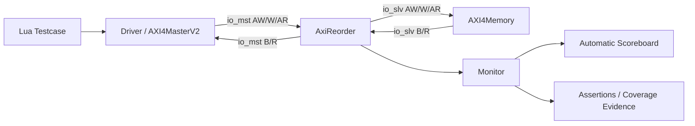

# AxiReorder 验证报告

> 文档状态：模板 / 待填写  
> 报告版本：`V0.1`  
> 验证对象：`AxiReorder`  
> 验证层级：模块级 UT

<!--
使用说明：
1. 将所有“待填写”“待确认”替换为实际数据；不适用项填写“N/A”并说明原因。
2. 报告中的通过结论必须能够追溯到日志、波形、覆盖率数据库或缺陷单。
3. 发布报告前删除本说明以及其他仅用于填写提示的 HTML 注释。
4. 不要根据用例名称推断结果；回归结果和覆盖率均以实际产物为准。
-->

## 1. 文档信息

### 1.1 基本信息

| 项目 | 内容 |
| --- | --- |
| 项目/子系统 | 待填写 |
| DUT 名称 | `AxiReorder` |
| DUT 版本/提交 | 待填写（Git commit/tag） |
| RTL 生成时间 | 待填写 |
| 验证环境版本/提交 | 待填写（Git commit/tag） |
| 报告覆盖周期 | 待填写（开始日期至结束日期） |
| 报告作者 | 待填写 |
| 审核人 | 待填写 |
| 报告日期 | 待填写 |
| 最终结论 | 待评审（通过 / 有条件通过 / 不通过） |

### 1.2 修订记录

| 版本 | 日期 | 作者 | 变更内容 | 审核人 |
| --- | --- | --- | --- | --- |
| V0.1 | 待填写 | 待填写 | 创建验证报告 | 待填写 |

### 1.3 参考资料

| 编号 | 文档/代码 | 版本或提交 | 用途 |
| --- | --- | --- | --- |
| REF-01 | `ChiselTemplate/src/main/scala/xs/infra/axi/AxiReorder.scala` | 待填写 | DUT 设计实现 |
| REF-02 | `ChiselTemplate/src/test/scala/generator/AxiReorderGen.scala` | 待填写 | DUT 生成配置 |
| REF-03 | `README.md` | 待填写 | 工程运行说明 |
| REF-04 | `test_points/*.lua` | 待填写 | 功能与微架构测试点 |
| REF-05 | AMBA AXI4 Protocol Specification | 待填写 | AXI4 协议依据 |

## 2. 报告摘要

### 2.1 验证结论

<!-- 用 3～5 句话概括验证范围、回归结果、覆盖率、遗留缺陷和最终建议。 -->

待填写。

### 2.2 关键结果

| 指标 | 目标 | 实际结果 | 状态 |
| --- | ---: | ---: | --- |
| 计划回归次数 | 待填写 | 待填写 | 待确认 |
| 用例通过率 | 100% | 待填写 | 待确认 |
| P1 测试点覆盖率 | 100% 或已批准豁免 | 待填写 | 待确认 |
| Line Coverage | 待填写 | 待填写 | 待确认 |
| Condition Coverage | 待填写 | 待填写 | 待确认 |
| Branch Coverage | 待填写 | 待填写 | 待确认 |
| Toggle Coverage（ports only） | 待填写 | 待填写 | 待确认 |
| Assertion 失败数 | 0 | 待填写 | 待确认 |
| 未关闭严重缺陷数 | 0 | 待填写 | 待确认 |

### 2.3 遗留风险

| 风险 ID | 风险描述 | 影响 | 缓解措施/豁免依据 | 责任人 | 状态 |
| --- | --- | --- | --- | --- | --- |
| RISK-001 | Mixed-ID Per-ID Order 测试点当前未反标具体用例 | 同 ID 顺序与不同 ID 并发组合的覆盖证据可能不足 | 补充约束随机用例或提供现有日志证据 | 待填写 | Open |
| RISK-002 | 待填写 | 待填写 | 待填写 | 待填写 | 待填写 |

## 3. DUT 概述

### 3.1 功能说明

`AxiReorder` 位于上游 AXI Master 与下游 AXI Slave 之间，为读、写事务分配内部重排表项 ID，并在响应返回时恢复原始 AXI ID。验证重点包括：

- 相同 ID 事务按接收顺序向下游发出并按序返回；
- 不同 ID 事务允许乱序完成；
- 下游使用表项 ID 返回 `R/B`，上游看到恢复后的原始 `RID/BID`；
- `AW/W` 独立通道在排队、背压和响应释放条件下保持正确关联；
- 重排表满载、依赖计数更新、仲裁和资源恢复行为正确；
- 复位期间不产生非法输出，复位后可恢复正常读写。

### 3.2 本次生成配置

以下为当前生成器默认配置，发布报告前应与本次 RTL 产物复核。

| 参数 | 配置值 | 说明 |
| --- | ---: | --- |
| `addrBits` | 48 | 地址宽度 |
| `idBits` | 12 | 上游原始 AXI ID 宽度 |
| `dataBits` | 256 | 数据宽度（32 Byte/beat） |
| `lenBits` | 8 | `AxLEN` 宽度 |
| `lastBits` | 1 | 支持 `RLAST/WLAST` |
| `buffer` | 64 | 读/写重排表项数 |
| 下游重映射 ID 有效位宽 | 6 | 由 64 个表项编号决定 |
| `AW` 队列深度 | 1 | 写地址排队 |
| `W` entry 队列深度 | 2 | 写数据与表项关联 |
| `W` 数据队列深度 | 2 | 写数据排队 |

### 3.3 接口概览

| 接口 | 方向（相对 DUT） | 通道 | 主要检查内容 |
| --- | --- | --- | --- |
| `io_mst_*` | 上游侧 | `AW/W/B/AR/R` | 接收原始 ID 请求，返回恢复后的响应 ID |
| `io_slv_*` | 下游侧 | `AW/W/B/AR/R` | 输出表项 ID 请求，接收携带表项 ID 的响应 |
| `clock` | 输入 | 时钟 | 所有 AXI 通道的采样时钟 |
| `reset` | 输入 | 复位 | 高电平有效，复位重排状态 |

### 3.4 验证范围

本报告包含：

- AXI 五通道握手与 payload 透传；
- 同 ID 读写顺序约束与不同 ID 乱序能力；
- `RID/BID` 重映射和恢复；
- `FIXED/INCR/WRAP`、不同 burst 长度、传输大小和响应码组合；
- 上下游随机延迟、背压、读写并发；
- 重排表容量、依赖计数、仲裁、浅 FIFO 瓶颈；
- 定向代码覆盖与结构性不可达项分析；
- 复位、断言、自动 scoreboard 收尾检查。

本报告不包含：

- CDC、时序收敛、功耗、DFT 和物理实现验证；
- 系统级互联集成与多模块端到端性能；
- AXI 协议违规输入的完整鲁棒性验证（除非在本次回归中另有说明）；
- Formal 证明（如未单独执行）。

## 4. 验证环境

### 4.1 环境架构



### 4.2 核心组件

| 组件 | 实现 | 职责 |
| --- | --- | --- |
| Test runner | `tc_main.lua` | 选择用例、设置随机种子、复位、启动 monitor、执行收尾检查 |
| Driver | `src/dut/driver.lua` | 提供 AXI Master 激励和下游 AXI Memory/响应注入 |
| Monitor | `src/dut/monitor.lua` | 按周期采样接口及关键内部状态并发布事务 |
| Scoreboard | `src/dut/scoreboard.lua` | 比较通道 payload、检查同 ID 顺序、ID 映射及未完成事务 |
| Common stimulus | `src/common/axi_stimulus.lua` | 生成合法地址、burst、数据与 strobe |
| Clock/reset | `src/common/clock_reset.lua`、`src/env.lua` | 时钟等待、默认输入和 DUT 复位 |
| Test-point model | `test_points/*.lua` | 测试点定义及用例反标 |

### 4.3 工具和版本

| 类别 | 工具 | 本次版本 | 备注 |
| --- | --- | --- | --- |
| 验证框架 | Verilua | 待填写 | 环境脚本参考 `v3.4.0` |
| RTL 生成 | Chisel / CIRCT / Mill | 待填写 | `AxiReorderGen` |
| 仿真器 | Synopsys VCS | 待填写 | 主要仿真器 |
| 备选仿真器 | Verilator | 待填写或 N/A | 若执行需记录结果 |
| 覆盖率 | VCS Coverage / URG / Verdi | 待填写 | `line+cond+tgl+branch` |
| 波形调试 | Verdi | 待填写 | FSDB |
| 构建系统 | xmake | 待填写 | 仿真目标管理 |
| 操作系统 | 待填写 | 待填写 | 主机/容器信息 |

### 4.4 随机化与检查策略

- 公共随机入口为 `SEED`；未显式指定时，`tc_main.lua` 使用种子 `1`。
- 随机用例默认 `LOOP=5000`；`009` 默认 `LOOP=1000`，实际配置须记录在回归清单中。
- AXI Master 最多管理 64 个并发任务，单任务超时上限为 2,000,000 周期。
- 下游 Memory 对通道插入随机延迟，并可注入 `OKAY/EXOKAY/SLVERR/DECERR` 响应。
- monitor 仅在 `valid && ready` 时形成有效握手记录。
- 每个用例结束时调用 `scoreboard.finish_auto_check()`，确保不存在未匹配请求、响应或 ID 映射。

## 5. 验证执行

### 5.1 执行基线

| 项目 | 本次值 |
| --- | --- |
| RTL commit/tag | 待填写 |
| TB commit/tag | 待填写 |
| RTL 文件校验值 | 待填写 |
| 编译选项 | 待填写 |
| 仿真模式 | 待填写（normal / coverage / xprop） |
| 用例集合 | 待填写 |
| Seed 集合 | 待填写 |
| `LOOP` 配置 | 待填写 |
| 回归输出目录 | 待填写 |
| 覆盖率数据库 | 待填写 |

### 5.2 常用命令

```bash
# 初始化 Verilua 环境
source /nfs/home/yanglucheng/tools/verilua/v3.4.0/verilua.sh

# 生成 RTL
xmake r -P . rtl

# 单用例仿真；根据需要替换 TC、SEED、LOOP
TC=004 SEED=1 LOOP=5000 MODE=1 xmake run -P . TestAxiReorder

# 生成波形
TC=004 SEED=1 LOOP=5000 DUMP=1 MODE=1 xmake run -P . TestAxiReorder

# 覆盖率仿真
TC=004 SEED=1 LOOP=5000 MODE=1 xmake run -P . TestAxiReorderVcsCov

# 查看波形或覆盖率
verdi -ssf build/vcs/TestAxiReorder/004.vcd.fsdb
verdi -cov -covdir build/vcs/TestAxiReorderVcsCov/sim_build/simv.vdb
```

<!-- 若使用 jobs-gen 批量回归，在此补充生成、提交、合并和日志汇总命令。 -->

### 5.3 回归配置

> 注意：当前 `jobs-gen` 默认用例列表为 `001` 至 `008`。`000` 以及 `009` 至 `012` 不会自动进入该默认回归，若属于本次签核范围，必须单独调度并在下表记录。

| 回归 ID | 模式 | 用例范围 | Seed | LOOP | 编译选项 | 开始时间 | 结束时间 | 产物目录 |
| --- | --- | --- | --- | ---: | --- | --- | --- | --- |
| REG-001 | normal | 待填写 | 待填写 | 待填写 | 待填写 | 待填写 | 待填写 | 待填写 |
| REG-002 | coverage | 待填写 | 待填写 | 待填写 | 待填写 | 待填写 | 待填写 | 待填写 |

## 6. 用例结果

### 6.1 用例汇总

状态仅允许填写 `PASS`、`FAIL`、`BLOCKED`、`NOT RUN` 或 `N/A`。

| TC | 用例文件 | 验证目标 | 类型 | Seed/LOOP | 结果 | 日志/波形证据 | 关联缺陷 |
| --- | --- | --- | --- | --- | --- | --- | --- |
| 000 | `000_smoke.lua` | 单笔写入后同地址读回，验证基础数据通路 | DT | 待填写 | NOT RUN | 待填写 | - |
| 001 | `001_reset.lua` | 复位期间输出静默，复位释放后读写恢复 | DT | 待填写 | NOT RUN | 待填写 | - |
| 002 | `002_same_id_write.lua` | 相同 AWID 多事务的发出/响应顺序及 BID 恢复 | CRV | 待填写 | NOT RUN | 待填写 | - |
| 003 | `003_different_id_write.lua` | 不同 AWID 写事务乱序完成及 BID 恢复 | CRV | 待填写 | NOT RUN | 待填写 | - |
| 004 | `004_same_id_read.lua` | 相同 ARID 多事务的发出/响应顺序及 RID 恢复 | CRV | 待填写 | NOT RUN | 待填写 | - |
| 005 | `005_different_id_read.lua` | 不同 ARID 读事务乱序完成及 RID 恢复 | CRV | 待填写 | NOT RUN | 待填写 | - |
| 006 | `006_random_id_read.lua` | 随机 ID、地址、burst、size 和响应的读压力测试 | CRV | 待填写 | NOT RUN | 待填写 | - |
| 007 | `007_random_id_write.lua` | 随机 ID、地址、burst、size、strobe 和响应的写压力测试 | CRV | 待填写 | NOT RUN | 待填写 | - |
| 008 | `008_parellel_RandW.lua` | 随机读写并发及通道隔离 | CRV | 待填写 | NOT RUN | 待填写 | - |
| 009 | `009.lua` | 64 项 AR 表满载、同 ID 依赖、仲裁阻塞和排空恢复 | DT/Stress | 待填写 | NOT RUN | 待填写 | - |
| 010 | `010.lua` | AW/W 浅 FIFO 背压与重排表容量的关系、逆序 B 恢复 | DT | 待填写 | NOT RUN | 待填写 | - |
| 011 | `011__GEN_2_conditioncoverage.lua` | `_GEN_2` 可达条件组合及不可达组合证明 | Coverage DT | 待填写 | NOT RUN | 待填写 | - |
| 012 | `012_linecoverage.lua` | 读表 `nid-2`、写表结构性不可达项及 `wWkEtrReg` 更新 | Coverage DT | 待填写 | NOT RUN | 待填写 | - |

### 6.2 回归统计

| 分类 | 数量 | 占比 |
| --- | ---: | ---: |
| 总运行数 | 待填写 | 100% |
| PASS | 待填写 | 待填写 |
| FAIL | 待填写 | 待填写 |
| BLOCKED | 待填写 | 待填写 |
| NOT RUN | 待填写 | 待填写 |
| N/A | 待填写 | 待填写 |

失败项摘要：

| 运行 ID | TC/Seed | 失败现象 | 根因分类 | 缺陷 ID | 处理结论 |
| --- | --- | --- | --- | --- | --- |
| 待填写 | 待填写 | 待填写 | RTL / TB / 环境 / 工具 | 待填写 | 待填写 |

## 7. 测试点覆盖

### 7.1 功能与微架构测试点

下表来自当前 `test_points/*.lua` 的反标关系。结果必须结合实际回归证据填写。

| 测试点 | 优先级 | 反标用例 | 预期检查 | 结果/说明 |
| --- | --- | --- | --- | --- |
| Read/SameID/ARIssueOrder | P1 | 004 | 后一笔同 ID AR 不先于前一笔完成下游 AR 握手 | 待填写 |
| Read/SameID/RResponseOrder | P1 | 004 | 后一事务首拍 R 不早于前一事务 RLAST | 待填写 |
| Read/DifferentID/OutOfOrderCompletion | P1 | 005 | 后接收事务可先完成 | 待填写 |
| Read/Response/RIDRestore | P1 | 004、005 | 上游 RID 恢复为原始 ARID | 待填写 |
| Read/MixedID/PerIDOrder | P1 | 未反标 | 重复 ID 与其他 ID 并发时保持每 ID 内部顺序 | 待补用例或证据 |
| Write/SameID/AWIssueOrder | P1 | 002 | 后一笔同 ID AW 不先于前一笔完成下游 AW 握手 | 待填写 |
| Write/SameID/BResponseOrder | P1 | 002 | 每个 ID 的 B 顺序与 AW 接收顺序一致 | 待填写 |
| Write/DifferentID/OutOfOrderCompletion | P1 | 003 | 后接收事务可先完成 | 待填写 |
| Write/Response/BIDRestore | P1 | 002、003 | 上游 BID 恢复为原始 AWID | 待填写 |
| Write/MixedID/PerIDOrder | P1 | 未反标 | 重复 ID 与其他 ID 并发时保持每 ID 内部顺序 | 待补用例或证据 |
| ReadWrite/Concurrent/ReadIsolation | P1 | 008 | R 响应仅匹配对应读事务 | 待填写 |
| ReadWrite/Concurrent/WriteIsolation | P1 | 008 | B 响应仅匹配对应写事务 | 待填写 |
| Read/ARTable/Capacity64 | P1 | 009 | 64 个 AR 表项可同时有效 | 待填写 |
| Read/ARTable/SameIDDependency | P1 | 009 | `nid` 等于同 ID 未完成前序事务数 | 待填写 |
| Read/ARArbitration/FixedPriority | P1 | 009 | 低编号竞争期间目标 entry 的仲裁行为符合规格 | 待确认规格和当前 RTL 仲裁策略 |
| Read/ARArbitration/DrainRecovery | P1 | 009 | 竞争停止并排空后目标最终发出 | 待填写 |

### 7.2 覆盖闭环统计

| 优先级 | 总测试点 | 已覆盖 | 未覆盖 | 已豁免 | 覆盖率 |
| --- | ---: | ---: | ---: | ---: | ---: |
| P0 | 待填写 | 待填写 | 待填写 | 待填写 | 待填写 |
| P1 | 16 | 待填写 | 待填写 | 待填写 | 待填写 |
| P2 | 待填写 | 待填写 | 待填写 | 待填写 | 待填写 |
| 合计 | 待填写 | 待填写 | 待填写 | 待填写 | 待填写 |

未覆盖测试点：

| 测试点 | 未覆盖原因 | 补充计划或豁免单 | 责任人 | 计划日期 |
| --- | --- | --- | --- | --- |
| Read/MixedID/PerIDOrder | 当前测试点未反标用例 | 待填写 | 待填写 | 待填写 |
| Write/MixedID/PerIDOrder | 当前测试点未反标用例 | 待填写 | 待填写 | 待填写 |

## 8. 覆盖率结果

### 8.1 代码覆盖率

覆盖率目标 `TestAxiReorderVcsCov` 当前配置 `line+cond+tgl+branch`，其中 toggle 仅统计端口。分别记录原始覆盖率和批准豁免后的有效覆盖率。

| 指标 | Covered/Total | 原始覆盖率 | Excluded/Waived | 有效覆盖率 | 目标 | 结论 |
| --- | --- | ---: | ---: | ---: | ---: | --- |
| Line | 待填写 | 待填写 | 待填写 | 待填写 | 待填写 | 待确认 |
| Condition | 待填写 | 待填写 | 待填写 | 待填写 | 待填写 | 待确认 |
| Branch | 待填写 | 待填写 | 待填写 | 待填写 | 待填写 | 待确认 |
| Toggle（ports only） | 待填写 | 待填写 | 待填写 | 待填写 | 待填写 | 待确认 |

覆盖率证据：

| 产物 | 路径/链接 | 说明 |
| --- | --- | --- |
| 原始 VDB | 待填写 | 未合并或单次仿真数据库 |
| 合并 VDB | 待填写 | 全部签核回归合并结果 |
| URG HTML/Text 报告 | 待填写 | 可审阅的覆盖率明细 |
| Exclusion 文件 | 待填写 | 经评审批准的排除规则 |

### 8.2 功能覆盖率与断言

| 指标 | 目标 | 结果 | 说明 |
| --- | ---: | ---: | --- |
| 测试点覆盖率 | 100% 或批准豁免 | 待填写 | 见第 7 节 |
| Assertion attempts | N/A | 待填写 | 待填写 |
| Assertion failures | 0 | 待填写 | 待填写 |
| Scoreboard failures | 0 | 待填写 | 待填写 |
| Scoreboard pending items at finish | 0 | 待填写 | 待填写 |

### 8.3 覆盖率豁免

已知需要重点评审的候选项包括：

- TC011 记录的 `_GEN_2` 条件组合 `C1=1、C4=0`：在合法端口事务下与状态不变量互斥；
- TC012 记录的 64 个写表 `nid-2` 分支：在当前 `buffer=64`、`awq entries=1` 结构下候选为结构性不可达；
- 仅由非法 AXI 响应、直接修改内部状态或参数未启用功能才能命中的代码，不应通过伪造激励获取覆盖。

所有候选项都必须经过设计和验证联合评审后才能计入有效覆盖率。

| Waiver ID | 指标/位置 | 未覆盖原因 | 可达性分析/证据 | 影响评估 | 审批人 | 状态 |
| --- | --- | --- | --- | --- | --- | --- |
| WVR-001 | `_GEN_2` 指定 condition row | 状态不变量导致不可达 | TC011 日志、波形和代码审查 | 待填写 | 待填写 | 待评审 |
| WVR-002 | AW entry 0..63 `nid-2` 分支 | 当前队列结构下不可达 | TC012 逐 entry 动态见证与代码审查 | 待填写 | 待填写 | 待评审 |
| WVR-003 | 待填写 | 待填写 | 待填写 | 待填写 | 待填写 | 待填写 |

## 9. 专项验证结果

### 9.1 复位与 X-Propagation

| 检查项 | 配置/场景 | 结果 | 证据 |
| --- | --- | --- | --- |
| 复位期间下游 `AW/AR/WVALID=0` | TC001 | 待填写 | 待填写 |
| 复位期间上游 `R/BVALID=0` | TC001 | 待填写 | 待填写 |
| 复位释放后可正常读写 | TC001 | 待填写 | 待填写 |
| XProp 模式 | 编译选项待填写 | 待填写 | 待填写 |
| X/Z 检查 | 待填写 | 待填写 | 待填写 |

### 9.2 压力、背压与边界

| 场景 | 主要配置 | 观测结果 | 结论 |
| --- | --- | --- | --- |
| 随机同 ID 读/写 | TC002、TC004，LOOP/SEED 待填写 | 待填写 | 待确认 |
| 随机不同 ID 读/写 | TC003、TC005 至 TC007，LOOP/SEED 待填写 | 待填写 | 待确认 |
| 并发读写 | TC008，LOOP/SEED 待填写 | 待填写 | 待确认 |
| 64 项 AR 表满载 | TC009 | 待填写 | 待确认 |
| AW/W 通道偏斜和浅 FIFO | TC010 | 待填写 | 待确认 |
| 条件/行覆盖定向场景 | TC011、TC012 | 待填写 | 待确认 |

### 9.3 性能观测（如适用）

<!-- AxiReorder UT 若无独立性能验收要求，可填写 N/A 并说明。 -->

| 指标 | 场景 | 目标 | 实测 | 结论 |
| --- | --- | ---: | ---: | --- |
| 无背压请求吞吐 | 待填写 | 待填写 | 待填写 | 待确认 |
| AR/AW 平均延迟 | 待填写 | 待填写 | 待填写 | 待确认 |
| 最坏同 ID 阻塞周期 | 待填写 | 待填写 | 待填写 | 待确认 |
| 仲裁公平性/最大等待 | 待填写 | 待填写 | 待填写 | 待确认 |

## 10. 缺陷分析

### 10.1 缺陷统计

| 严重等级 | 新增 | 已修复并回归 | 已关闭 | 遗留 | 签核要求 |
| --- | ---: | ---: | ---: | ---: | --- |
| Blocker | 待填写 | 待填写 | 待填写 | 待填写 | 必须为 0 |
| Critical | 待填写 | 待填写 | 待填写 | 待填写 | 必须为 0 |
| Major | 待填写 | 待填写 | 待填写 | 待填写 | 待评审 |
| Minor | 待填写 | 待填写 | 待填写 | 待填写 | 可带风险签核 |

### 10.2 缺陷明细

| Bug ID | 严重等级 | 标题 | 发现用例 | 根因 | 修复版本 | 回归结果 | 状态 |
| --- | --- | --- | --- | --- | --- | --- | --- |
| 待填写 | 待填写 | 待填写 | 待填写 | 待填写 | 待填写 | 待填写 | 待填写 |

### 10.3 验证环境问题

| Issue ID | 问题描述 | 影响范围 | 规避/修复 | 状态 |
| --- | --- | --- | --- | --- |
| 待填写 | 待填写 | 待填写 | 待填写 | 待填写 |

## 11. 签核检查表

| 签核项 | 验收标准 | 结果 | 证据/备注 |
| --- | --- | --- | --- |
| 需求与测试点评审完成 | 所有 P0/P1 测试点有用例或批准豁免 | 待确认 | 待填写 |
| 回归完成 | 计划内运行全部完成，非预期 FAIL 为 0 | 待确认 | 待填写 |
| 随机稳定性 | 关键 CRV 用例覆盖计划 seed 数且无失败 | 待确认 | 待填写 |
| 功能覆盖达标 | 达到目标或有批准豁免 | 待确认 | 待填写 |
| 代码覆盖达标 | 各项达到目标或有批准豁免 | 待确认 | 待填写 |
| 断言/scoreboard | 失败数为 0，结束时无 pending 项 | 待确认 | 待填写 |
| 缺陷收敛 | Blocker/Critical 遗留为 0 | 待确认 | 待填写 |
| Waiver 评审 | 所有 exclusion 均有设计/验证审批 | 待确认 | 待填写 |
| 结果可复现 | commit、命令、seed、LOOP 和产物路径完整 | 待确认 | 待填写 |
| 文档评审 | 设计、验证负责人完成审核 | 待确认 | 待填写 |

## 12. 最终结论与审批

### 12.1 最终结论

<!--
建议格式：
“基于 <RTL/TB 版本>，已完成 <范围> 验证。共执行 <N> 次仿真，<P> 次通过、
<F> 次失败；有效代码覆盖率为 <...>，P1 测试点覆盖率为 <...>。当前遗留
<缺陷/风险>。结论为 <通过/有条件通过/不通过>，适用于 <交付范围>。”
-->

待填写。

### 12.2 审批记录

| 角色 | 姓名 | 意见 | 日期 | 结论 |
| --- | --- | --- | --- | --- |
| 验证负责人 | 待填写 | 待填写 | 待填写 | 待审批 |
| 设计负责人 | 待填写 | 待填写 | 待填写 | 待审批 |
| 项目负责人 | 待填写 | 待填写 | 待填写 | 待审批 |

## 附录 A：验证产物索引

| 产物 | 路径/链接 | 保留策略 | 备注 |
| --- | --- | --- | --- |
| 回归日志 | 待填写 | 待填写 | 每个 TC/Seed 独立保存 |
| 失败波形 | 待填写 | 待填写 | FSDB |
| 覆盖率数据库 | 待填写 | 待填写 | VCS VDB |
| 覆盖率报告 | 待填写 | 待填写 | URG HTML/Text |
| 测试点报告 | `build/AxiReorder_ut_test_points.md` | 随版本保存 | 由 `test_points/main.lua` 生成 |
| 缺陷列表 | 待填写 | 待填写 | 缺陷系统导出或链接 |
| Waiver/Exclusion | 待填写 | 随签核版本保存 | 包含审批记录 |

## 附录 B：术语

| 缩写 | 全称 | 说明 |
| --- | --- | --- |
| DUT | Design Under Test | 被测设计 |
| UT | Unit Test | 模块级验证 |
| CRV | Constrained-Random Verification | 约束随机验证 |
| DT | Directed Test | 定向测试 |
| AXI | Advanced eXtensible Interface | AMBA 总线协议 |
| ID | Transaction Identifier | AXI 事务标识 |
| NID | Number of Incomplete Dependencies | 当前事务之前未完成的同 ID 事务数量 |
| SB | Scoreboard | 自动比对器 |
| VDB | Verification Database | VCS 覆盖率数据库 |
| FSDB | Fast Signal Database | Verdi 波形数据库 |
| Waiver | Coverage Waiver | 经评审批准的覆盖率豁免 |
